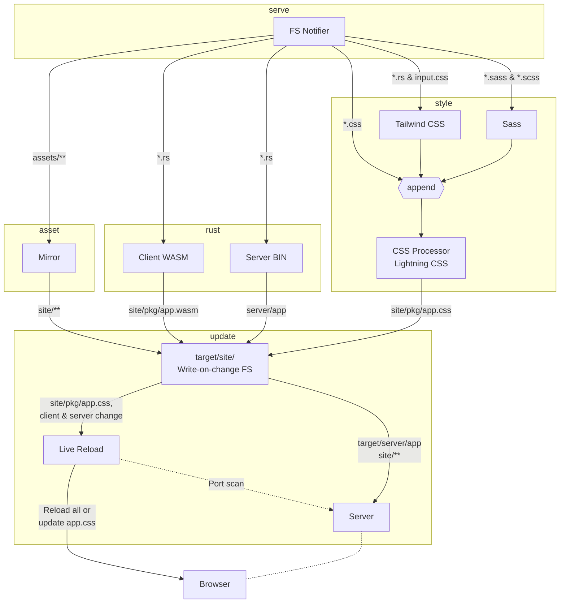

# glory-cli — the Glory build tool

`glory-cli` is installed as the `glory` binary. It bundles wasm
compilation (via `wasm-bindgen`), Sass / Tailwind / Lightning CSS
processing, static-asset mirroring, an HTTP serve loop, and a
filesystem watcher into a single subcommand-driven CLI.

## Install

```sh
cargo install --path crates/cli      # from this workspace
# or
cargo install glory-cli              # from crates.io once released
```

Both forms produce the `glory` binary on your `PATH`.

## Subcommands

```text
glory new            scaffold a new Glory project from a built-in template
glory build          one-shot build into the site dir
glory bundle         release build and collect distributable artifacts
glory serve          like `build`, then host the result over HTTP
glory serve --no-reload
                     build and serve once without filesystem watching
glory serve --port 8080 --no-open
                     override the configured site port and skip browser open
glory serve --https --tls-cert cert.pem --tls-key key.pem
                     advertise/open https and pass TLS paths to the app server
glory serve --proxy /api=http://127.0.0.1:9001
                     pass dev proxy rules to the app server
glory run --no-open
                     build and run once without watching or live reload
glory doctor         check local toolchains for the selected target
glory config         validate Glory Cargo metadata
glory config --schema
                     print the Glory Cargo metadata schema
glory completions powershell
                     generate shell completions to stdout
glory self-update    print update instructions for the installed CLI
glory check          type-check the configured targets
glory fmt            run cargo fmt
glory test           run cargo test for the current project targets
glory end-to-end     run end-to-end tests (uses Playwright when configured)
```

Each subcommand accepts `--help` for its flags. Global flags live on
`glory` itself (`--manifest-path`, `--release`, `--verbose`, etc.).
`glory new --template <web|ssr|fullstack|desktop|mobile> --name my-app`
uses built-in templates; pass `--git` or `--path` to use a cargo-generate
template instead.

In `glory serve` watch mode, line controls are available on stdin: `r` + Enter
forces a rebuild, `v` + Enter cycles the log level, and `/` + Enter prints the
control help.

`glory serve --https` switches the advertised/opened site URL to `https://`.
TLS paths and repeated `--proxy PATH=URL` rules are exposed to the launched app
server through `GLORY_TLS_CERT`, `GLORY_TLS_KEY`, and `GLORY_PROXY_CONFIG`.

## Typical workflow

```sh
glory new my-app
cd my-app
glory serve
# edit src/...; refresh the browser; rebuilds run on save
```

For deployment:

```sh
glory bundle --release
# dist/<project>/ contains the deployable artefact
```

Use `glory bundle --optimize-images` to keep original PNG/JPEG assets and add
WebP copies, with `glory-bundle.json` preferring the hashed WebP path.

For mobile projects generated with `glory new --template mobile`, use
`glory bundle --target android|ios --release`. Android bundles collect APKs
and install/run scripts under `dist/<project>/android/`; iOS bundles collect
`.app` bundles and optional archives under `dist/<project>/ios/`.

## Project layout the tool expects

```
my-app/
  Cargo.toml          # contains [package.metadata.glory] config (output_name, site_*)
  src/main.rs         # or src/lib.rs for SSR projects
  style/main.scss     # optional, processed via Sass + Lightning CSS
  public/             # assets, mirrored verbatim to site/
```

The `[package.metadata.glory]` keys correspond 1-to-1 with
[`GloryConfig`](../core/src/config.rs) (`output_name`, `site_root`,
`site_pkg_dir`, `site_addr`, `reload_port`, ...).

---

# Internals

## File view

This is mainly relevant for `serve` mode.



## Concurrency view

Very approximate

```mermaid
stateDiagram-v2
    wasm: Build front
    bin: Build server
    style: Build style
    asset: Mirror assets
    serve: Run server

    state wait_for_start <<fork>>
      [*] --> wait_for_start
      wait_for_start --> wasm
      wait_for_start --> bin
      wait_for_start --> style
      wait_for_start --> asset

    reload: Reload
    state join_state <<join>>
      wasm --> join_state
      bin --> join_state
      style --> join_state
      asset --> join_state
    state if_state <<choice>>
        join_state --> if_state
        if_state --> reload: Ok
        if_state --> serve: Ok
        if_state --> [*] : Err
```
